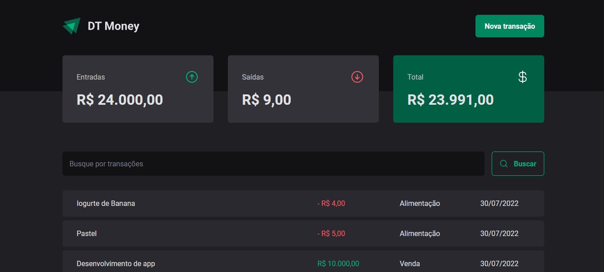

# DT Money


This project was developed during the [Rocketseat's](https://www.rocketseat.com.br) Ignite BootCamp.

Developed with `React`, `Typescript`, `Axios` and `Styled-Components`.

<p align=center>
  
</p>

## 💻 Run The Project

```bash
# Install the Dependencies
$ npm install

# Run the Server
$ npm run dev:server

# Run the Web Application
$ npm run dev
